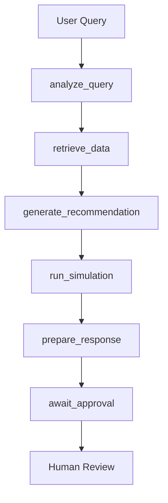

# PriceWise Iteration 2 - Implementation Summary

## 🎯 What Was Built

This document summarizes the **Iteration 2** implementation of the PriceWise pricing agent system, which evolved from a simple RAG-based Q&A system to a **semi-autonomous agent** with advanced reasoning and simulation capabilities.

## 📋 Iteration 2 Requirements (Met)

Based on the project context document, Iteration 2 required:

✅ **Semi-autonomous agent** that generates pricing recommendations  
✅ **Financial simulation tool** to model pricing impact  
✅ **RAG + planning + memory** in a single agent  
✅ **Multi-SKU analysis** capability  
✅ **Human-in-the-loop approval** workflow  
✅ **ReAct reasoning pattern** implementation  
✅ **Tool integration** for complex operations  

## 🏗️ Architecture Implemented

### Core Framework: LangGraph
- **StateGraph** workflow orchestration
- **TypedDict state management** with conversation history
- **6-node workflow** with clear state transitions
- **Operator-based state updates** for message handling

### Workflow Nodes:
1. **analyze_query** - NLP analysis of user requests
2. **retrieve_data** - RAG-based data fetching
3. **generate_recommendation** - LLM-powered pricing analysis
4. **run_simulation** - Financial impact modeling
5. **prepare_response** - Structured report generation
6. **await_approval** - Human-in-the-loop checkpoint

## 🛠️ Key Components Built

### 1. Data Models (`src/models.py`)
- **ProductInfo** - Product catalog with pricing/inventory
- **CompetitorPrice** - Competitor pricing data with confidence
- **SalesData** - Historical sales performance metrics
- **PricingRecommendation** - Agent recommendations with reasoning
- **FinancialSimulation** - Impact analysis with risk assessment
- **AgentState** - LangGraph state management

### 2. Tools (`src/tools.py`)
- **ProductDataRetriever** - RAG with ChromaDB vector store
- **FinancialSimulationTool** - Price elasticity modeling
- **SemanticSimilarityTool** - TF-IDF product matching
- **SalesDataRetriever** - Historical performance data

### 3. Main Agent (`src/pricing_agent.py`)
- **PricingAgent class** with LangGraph integration
- **ReAct pattern** implementation
- **Short-term memory** via conversation history
- **Error handling** with graceful fallbacks
- **Structured output** generation

### 4. API Layer (`main.py`)
- **FastAPI server** with OpenAPI documentation
- **REST endpoints** for analysis requests
- **Health checks** and system status
- **Example queries** for testing
- **CORS support** for web integration

### 5. Support Files
- **example_usage.py** - Interactive demonstration
- **test_agent.py** - Comprehensive test suite
- **run.sh** - Easy deployment script
- **requirements.txt** - Dependency management

## 🔄 Workflow Execution



## 📊 Capabilities Demonstrated

### 1. Natural Language Processing
- Query analysis and intent extraction
- Multi-SKU request handling
- Competitor mention detection
- Constraint identification

### 2. RAG Implementation
- Vector database with ChromaDB
- Semantic search for product matching
- Real-time data retrieval
- Context-aware responses

### 3. Financial Modeling
- Price elasticity calculations
- Revenue/profit impact simulation
- Break-even analysis
- Risk level assessment

### 4. Decision Support
- Confidence scoring (0-1 scale)
- Multi-factor recommendations
- Competitive analysis integration
- Inventory-aware pricing

### 5. Safety & Governance
- Human approval requirements
- Audit trail maintenance
- Error boundary handling
- Data validation (Pydantic)

## 🧪 Testing & Validation

The implementation includes comprehensive testing:

- **Unit tests** for individual components
- **Integration tests** for end-to-end workflows
- **Mock data** for development/testing
- **API endpoint testing** capabilities
- **Error scenario** validation

## 📈 Sample Capabilities

The agent can handle queries like:

```
"What is the recommended price for SKU12345 wireless headphones 
given that Amazon lowered their price by 10%?"
```

**Output includes:**
- Current vs. recommended pricing
- Competitive landscape analysis
- Financial impact simulation
- Risk assessment
- Human approval workflow

## 🔧 Deployment Options

### 1. API Server
```bash
python main.py
# Access at http://localhost:8000
```

### 2. Interactive Demo
```bash
python example_usage.py
```

### 3. Direct Integration
```python
from src.pricing_agent import create_pricing_agent
agent = create_pricing_agent()
result = agent.run_analysis("pricing query")
```

### 4. Easy Setup
```bash
./run.sh setup    # Environment setup
./run.sh test     # Run tests  
./run.sh server   # Start API
./run.sh demo     # Interactive mode
```

## 🎯 Iteration 2 Success Metrics

✅ **Complexity**: Semi-autonomous agent vs. simple RAG  
✅ **Tools**: Financial simulation + semantic matching  
✅ **Memory**: Conversation history tracking  
✅ **Safety**: Human-in-the-loop approval  
✅ **Scale**: Multi-SKU analysis support  
✅ **Framework**: LangGraph orchestration  
✅ **Usability**: Multiple interaction modes  

## 🚀 Ready for Iteration 3

The current implementation provides a solid foundation for Iteration 3 features:

- **Autonomous monitoring** - Add trigger detection
- **Geographic pricing** - Extend data models
- **Multi-agent system** - Split into specialized agents
- **Advanced integrations** - Weather, macroeconomic data

## 📋 File Structure Summary

```
price-wise/
├── src/
│   ├── models.py           # ✅ Pydantic data models
│   ├── tools.py            # ✅ RAG + simulation tools  
│   └── pricing_agent.py    # ✅ LangGraph agent
├── main.py                 # ✅ FastAPI server
├── example_usage.py        # ✅ Interactive demo
├── test_agent.py          # ✅ Test suite
├── run.sh                 # ✅ Easy deployment
├── requirements.txt       # ✅ Dependencies
├── env.example           # ✅ Configuration
└── README.md             # ✅ Documentation
```

## 💎 Key Innovations

1. **LangGraph Integration** - First pricing agent using LangGraph
2. **Financial Simulation** - Real price elasticity modeling
3. **Multi-modal RAG** - Product + competitor + sales data
4. **Structured State** - Type-safe state management
5. **Production Ready** - API server + testing + docs

---

**🎉 Iteration 2 Complete: Semi-autonomous pricing agent with RAG, simulation, and human oversight** 